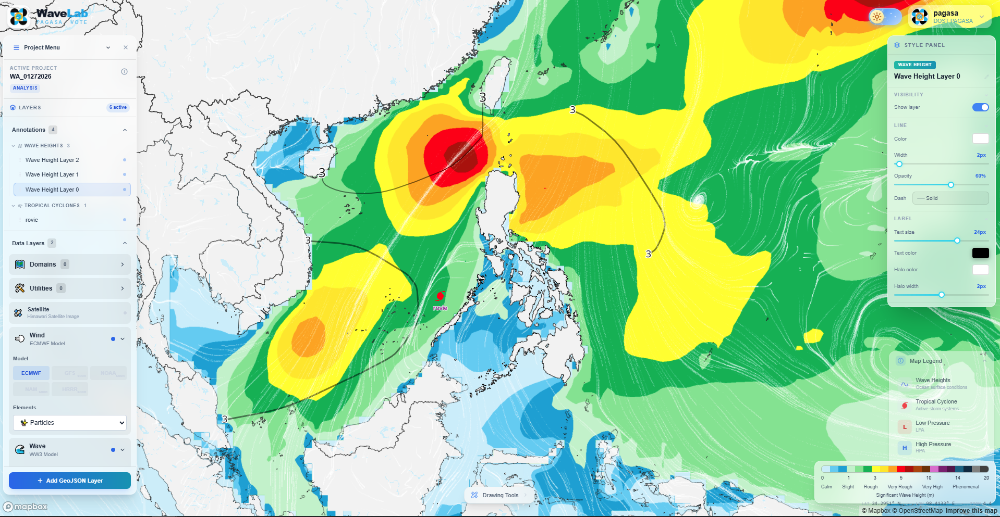
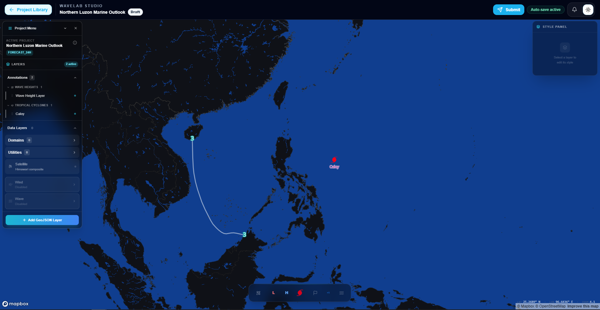

# PAGASA:VOTE WaveLab

WaveLab is a web-based marine forecast operations platform for creating, annotating, reviewing, revising, approving, and publishing forecast chart projects.

The application combines a Mapbox-powered Studio workspace, project library, role-based review workflow, and persistent project annotations so Forecasters and Admin reviewers can manage forecast products from draft to publication.

## Overview

WaveLab supports a controlled project workflow for marine forecast chart preparation. Forecasters can create projects, add markers and map annotations in Studio, submit work for review, and revise projects when requested. Admin users can review submitted charts, compare versions, add remarks, request revisions, approve, reject, and publish projects.

The system is designed around two main work areas:

- **Project Library and Studio**: used by Forecasters to manage projects, place forecast markers, draw annotations, and submit charts for review.
- **Review Charts and Project Review Modal**: used by Admin reviewers to inspect submissions, compare changes, provide feedback, and publish approved work.

## Media

### WaveLab dashboard



### Screenshot placeholders

Add future README screenshots to `docs/images/readme/` and reference them here.

| Area | Suggested file | Description |
|---|---|---|
| Project Library | `docs/images/readme/project-library.png` | Project card/list view with filters and status counters. |
| Studio | `docs/images/readme/studio-map-workspace.png` | Map workspace with toolbar, layer panel, and forecast annotations. |
| Review Charts | `docs/images/readme/admin-review-charts.png` | Admin review queue for submitted projects. |
| Review Modal | `docs/images/readme/review-modal-preview.png` | Preview/diff review modal with remarks and actions. |
| Dark Mode | `docs/images/readme/dark-mode.png` | Theme-aware Project Library or Studio view. |

Example:

```md

```

Guidelines:

- Use PNG screenshots.
- Keep screenshots focused on the relevant UI area.
- Use sample data when possible.
- Keep file names lowercase and descriptive.

## Key Features

### Project workflow

- Draft, Submitted, Under Review, Revision Requested, Approved, Rejected, Published, and Archived project states
- Edit-lock protection for submitted, reviewed, approved, published, and archived projects
- Forecaster resubmission flow for revision-requested projects
- Admin review actions with required remarks where appropriate
- Workflow validation utilities and backend workflow tests

### Studio map workspace

- Mapbox GL JS map interface
- Marker and symbol placement for forecast annotations
- Typhoon, low-pressure area, high-pressure area, and less-than-1m wave markers
- Drawing tools for wave-height/front-style annotations
- Layer panel with visibility, rename, delete, lock, and reorder support
- Read-only Studio mode for locked project statuses
- Light/dark theme support

### Project Library

- Card and list views
- Search, filter, sort, and date range controls
- Status-aware project actions
- Project preview maps with annotation markers
- Filter-aware statistic counters
- Responsive and theme-aware UI

### Admin Review

- Review Charts page for submitted and reviewable projects
- Project Review Modal with project summary, preview, diff, counters, remarks, and action buttons
- Preview and diff map modes
- Review comments and audit-style activity tracking
- Revision request, approve, reject, and publish actions

### Notifications and user experience

- Notification bell for project/review activity
- Theme-aware header, sidebar, project library, review modal, and Studio controls
- Lightweight loading states and responsive layout improvements

## Tech Stack

### Frontend

- React 18
- Vite
- Mapbox GL JS
- Mapbox GL Draw
- React Konva / Konva
- Tailwind CSS
- MUI
- SweetAlert2
- Axios
- React Router
- Recharts

### Backend

- Node.js
- Express 5
- MongoDB / Mongoose
- JWT authentication
- Socket.IO
- Redis support
- Winston logging
- Node test runner

## Repository Structure

```txt
pagasa-wave/
├── backend/              # Express API, models, controllers, routes, tests
├── frontend/             # React/Vite frontend application
├── docs/                 # Project documentation and user manuals
├── wavetiles/            # Wave tile/rendering utilities and supporting data
└── README.md
```

## Getting Started

### Prerequisites

Install the following before running the project locally:

- Node.js
- npm or pnpm
- MongoDB connection string
- Mapbox access token

### Backend setup

```bash
cd backend
npm install
npm run dev
```

For production-style startup:

```bash
cd backend
npm start
```

### Frontend setup

```bash
cd frontend
npm install
npm run dev
```

Build the frontend for production:

```bash
cd frontend
npm run build
```

Preview the production build:

```bash
cd frontend
npm run preview
```

## Testing

Run all backend tests:

```bash
cd backend
npm test
```

Run workflow-specific tests:

```bash
cd backend
npm run test:workflow
```

Recommended release validation:

```bash
cd backend
npm run test:workflow
```

```bash
cd frontend
npm run build
```

## User Roles

### Forecaster

Forecasters can:

- Create forecast chart projects
- Open editable projects in Studio
- Add markers, symbols, drawings, and annotations
- Save work while a project is editable
- Submit projects for Admin review
- Revise and resubmit projects after a revision request

Forecasters cannot edit projects that are already submitted, under review, approved, published, or archived.

### Admin

Admins can:

- View submitted and reviewable projects
- Open projects in the review modal
- Inspect preview and diff maps
- Add review comments
- Request revisions
- Approve, reject, and publish projects

Admins cannot review their own projects.

## Project Status Workflow

| Status | Meaning | Editable by Forecaster? | Typical next action |
|---|---|---:|---|
| Draft | Project is being prepared. | Yes | Forecaster edits and submits. |
| Submitted | Project has been submitted for review. | No | Admin starts review. |
| Under Review | Admin is reviewing the project. | No | Admin comments, approves, rejects, or requests revision. |
| Revision Requested / Needs Revision | Admin requested changes. | Yes | Forecaster revises and resubmits. |
| Approved | Project passed review. | No | Admin publishes. |
| Rejected | Project was rejected. | Yes, when allowed | Forecaster revises or resubmits if appropriate. |
| Published | Project is finalized and published. | No | No editing. |
| Archived | Project is archived. | No | No editing. |

## Documentation

User-facing documentation is stored in `docs/`.

Important documents include:

- `docs/wavelab-user-manual.md` - WaveLab User Manual for Forecaster and Admin users
- `docs/images/wavelab-user-manual/README.md` - screenshot checklist for the visual manual

## Development Notes

- Keep feature edits tied to the active `projectId`; avoid relying on stale localStorage project values.
- Project status checks should be enforced in both frontend UI and backend API handlers.
- Marker and layer operations should keep Mapbox layer/source IDs, layer panel state, and backend feature `sourceId` values synchronized.
- Before merging release work, run backend workflow tests and the frontend production build.

## Contributors

- [Karl Santiago Bernaldez](https://github.com/karlbernaldez) - Lead Developer
- DOST-MECO-TECO-VOTE III Project Team

## License

This project is licensed under the MIT License.
