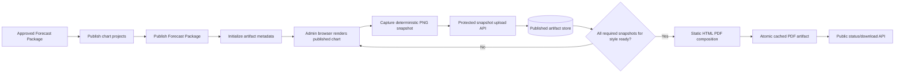

# WaveLab Published PDF Artifact Pipeline

**Status:** Proposed implementation in progress

**Applies to:** Published Forecast Package chart-set PDF generation

**Primary objective:** Generate stable, cacheable PDFs without rendering Mapbox/WebGL inside the backend process.

## Design summary

WaveLab now treats the published chart image as an immutable publication artifact. The browser that already renders the approved chart captures a deterministic PNG snapshot after publication. The backend stores that snapshot with source metadata and then composes the final PDF from static images only.

This deliberately separates **map rendering** from **PDF composition**:

- Mapbox/WebGL rendering happens in the authenticated admin browser.
- The backend stores only validated PNG snapshots for published package charts.
- Server-side PDF generation loads those PNG files into a static HTML layout.
- Puppeteer is used only as an HTML-to-PDF printer and does not initialize Mapbox or WebGL.
- The final PDF is written atomically and cached for public download.

## Pipeline



## Artifact layout

The production artifact root is:

```text
/var/lib/wavelab/published-artifacts/
  <forecast-package-id>/
    snapshots/
      wave-wind/
        analysis.png
        forecast_24h.png
        forecast_36h.png
        forecast_48h.png
      wave-only/
        analysis.png
        forecast_24h.png
        forecast_36h.png
        forecast_48h.png
      visually-impaired/
        analysis.png
        forecast_24h.png
        forecast_36h.png
        forecast_48h.png
    pdf/
      wave-chart-set-YYYY-MM-DD-wave-wind.pdf
      wave-chart-set-YYYY-MM-DD-wave-only.pdf
      wave-chart-set-YYYY-MM-DD-visually-impaired.pdf
```

The application may retain the legacy `PUBLISHED_PDF_DIR` variable during migration, but new deployments should use:

```text
PUBLISHED_ARTIFACT_DIR=/var/lib/wavelab/published-artifacts
```

## Snapshot contract

Each stored published chart snapshot is associated with:

- Forecast Package ID
- project ID
- forecast chart type
- published chart style
- file path and file name
- file size
- SHA-256 digest
- source revision
- capture timestamp

The backend validates that:

1. the Forecast Package is already Published;
2. the project belongs to that Forecast Package chart slot;
3. the project itself is Published;
4. the chart style is one of the supported published styles;
5. the uploaded payload is a PNG data URL;
6. the decoded file is within the configured size limit; and
7. the PNG file signature is valid.

The backend derives the stored file path. The client cannot choose an arbitrary server path.

## Source revision and stale artifact protection

A snapshot is considered current only when its `sourceRevision` matches the revision derived from the published package and linked published chart projects.

A PDF style can be generated only when all required chart slots have valid current snapshots for that style.

When a snapshot for a style is replaced, the corresponding PDF artifact is reset to `pending` and regenerated from the current snapshot set.

This prevents an older chart image from being silently combined with a newer publication revision.

## Publication workflow

The publication sequence is:

1. Admin publishes all approved chart projects.
2. Admin publishes the Forecast Package.
3. Backend initializes published artifact metadata.
4. The authenticated admin browser captures snapshots sequentially.
5. Each PNG is uploaded through the protected artifact endpoint.
6. When all snapshots for one style are present, the backend queues PDF composition.
7. The backend creates the PDF from static PNG files.
8. Public status changes to `ready`.
9. Public clients download the cached PDF directly.

Sequential capture is intentional. It avoids creating twelve simultaneous Mapbox/WebGL instances and reduces browser and server pressure.

## Existing package backfill

The Admin Forecast Package Review workspace checks the latest visible Published package for missing artifacts. If snapshots are incomplete, it can resume capture in the authenticated admin browser.

This supports packages that were published before the static-artifact pipeline was deployed.

## Public API behavior

The public status endpoint reports one of the following operational states:

- `awaiting-snapshots`: published chart PNG artifacts are still being captured;
- `pending`: snapshots are complete and PDF composition is queued;
- `generating`: static PDF composition is in progress;
- `ready`: the cached PDF exists and can be downloaded;
- `failed`: PDF composition failed.

The public download endpoint never renders a chart. It serves an existing cached PDF only.

## Reliability controls

### Atomic writes

Snapshots and PDFs are written to a temporary file and renamed into place only after the complete file has been written.

### In-process deduplication

The backend maintains one active PDF composition promise per Forecast Package to avoid duplicate composition work from concurrent status requests.

### Immutable publication semantics

Published chart snapshots are tied to the published source revision rather than mutable working data.

### Bounded upload size

Snapshot PNG payloads are limited to 3 MB decoded size so base64 JSON uploads remain below the existing API request-body limit.

### No server-side Mapbox

The backend does not:

- open WaveLab public chart pages;
- initialize Mapbox GL;
- render WebGL;
- wait for map selector readiness;
- use SwiftShader for chart rendering; or
- create hidden map instances for PDF generation.

## Cleanup policy

The new implementation should remove or retire code that supported the abandoned headless-map rendering path once rollout validation succeeds.

Cleanup targets include:

- server-side page navigation and Mapbox capture logic;
- headless browser request diagnostics that were specific to map rendering;
- dead client-side PDF fallback state on the public Charts page;
- legacy hidden export-map mounting on the public page;
- temporary formatting/debug CI steps;
- obsolete `PUBLISHED_PDF_DIR` configuration after the migration period; and
- old files under `/var/lib/wavelab/published-pdfs` after new artifacts are verified.

Do **not** delete the legacy directory during the same deployment that introduces the new pipeline. Keep rollback possible until at least one operational package has generated and downloaded successfully with all supported styles.

## Rollout and rollback

### Rollout

1. Merge and deploy the new artifact pipeline.
2. Confirm `PUBLISHED_ARTIFACT_DIR` exists and is writable by the WaveLab service user.
3. Open the Admin Forecast Package Review workspace.
4. Allow the latest Published package to backfill snapshots.
5. Confirm the three PDF styles reach `ready`.
6. Download each PDF and visually compare it with the published charts.
7. Confirm repeated downloads do not launch Mapbox rendering or additional PDF work.
8. After an observation period, remove the legacy PDF directory and compatibility configuration.

### Rollback

If snapshot capture or static PDF composition fails during rollout:

1. stop artifact backfill;
2. leave existing public chart publication untouched;
3. restore the previous application revision;
4. preserve both artifact directories for diagnosis; and
5. do not remove stored publication snapshots until the rollback investigation is complete.

## Operational validation

A release is considered successful when all of the following are true:

- each required chart slot has a PNG snapshot for all supported styles;
- snapshot SHA-256 values and source revisions are populated;
- all three PDF artifacts report `ready`;
- PDF files exist below the configured artifact root;
- public download returns the cached files;
- repeated public status requests do not create chart-rendering Chrome processes; and
- the backend logs no Mapbox/WebGL rendering activity for PDF generation.
