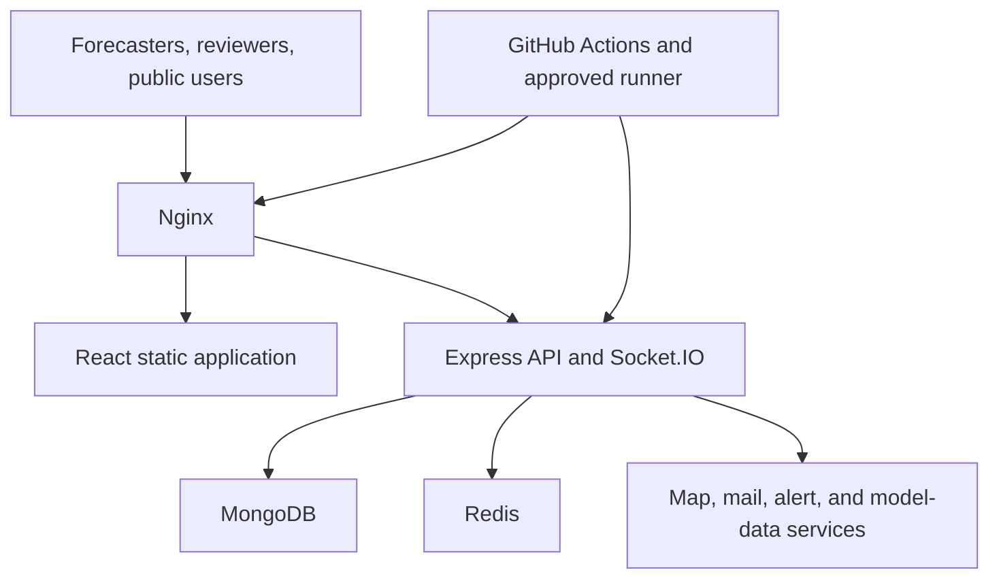

# WaveLab system architecture baseline

**Status:** Draft current-state assessment  
**Source:** Repository documentation and configuration  
**Architecture approval:** Pending

## Context

WaveLab supports internal forecast preparation and review and exposes authorized published chart products to public users. The system processes operationally significant forecast, annotation, review, identity, and publication data.

## Current logical components

| Component | Responsibility | Principal technologies |
|---|---|---|
| Web client | Public pages, Forecaster Studio, review/admin interfaces, exports | React, Vite, Mapbox GL, Konva |
| API service | Authentication, workflow, projects/packages, publication, notifications, administration | Node.js, Express |
| Real-time service | User and workflow events | Socket.IO, Redis adapter |
| Primary database | Users, projects/packages, annotations, review state and application records | MongoDB/Mongoose |
| Cache/message dependency | Real-time coordination and related runtime needs | Redis |
| Wave processing/tile utilities | Prepare and render wave/model data for presentation | Python and repository utilities |
| Edge/web server | TLS termination when configured, static frontend, API and Socket.IO proxy | Nginx |
| Service manager | Runs and restarts backend | systemd |
| Delivery pipeline | Tests, builds, deploys, verifies, and rolls back | GitHub Actions, self-hosted runner, scripts |
| External services | Maps, email, alerts, data/model sources | Provider-specific integrations |

## Current deployment view

The exact authorized production topology, network zones, certificate management, database hosting, backup destination, and external-service agreements remain to be approved.

## Trust boundaries

1. Public internet to Nginx.
2. Browser to authenticated API and Socket.IO channels.
3. Application service to MongoDB and Redis.
4. Application and browser to external map, email, alert, and model-data services.
5. GitHub-hosted control plane to the self-hosted deployment runner.
6. Operators and administrators to server, repository, database, and service controls.
7. R&D/test data and identities to any future operational environment.

Each boundary requires documented authentication, authorization, encryption, allowed flows, logging, availability behavior, and owner.

## Critical data flows

### Forecast preparation

1. Wave/model inputs and metadata become available.
2. A Forecaster creates or opens a forecast package and chart.
3. The client loads map/model content and persisted annotations.
4. Edits are validated and stored with project/package identity.
5. The Forecaster submits a complete package.

### Review and publication

1. An independent reviewer loads the submitted immutable version.
2. The system presents current content and relevant changes.
3. The reviewer comments, requests revision, rejects, or approves.
4. An authorized publisher publishes an approved, unchanged product.
5. The public interface exposes only the authorized published version.
6. Audit records preserve actors, versions, timestamps, and decisions.

### Deployment

1. A reviewed change merges to the protected release branch.
2. CI installs locked dependencies, tests backend/frontend, and builds.
3. An approved production environment gate releases the exact revision.
4. The self-hosted runner invokes a restricted deployment wrapper.
5. Services and public routes are smoke-tested.
6. Failure diagnostics are collected and an authorized rollback may restore a known-good revision.

## Architectural risks and required decisions

| Decision/risk | Current observation | Required action |
|---|---|---|
| Artifact integrity | Deployment rebuilds/installs on the target server | Adopt an immutable, checksummed release artifact after staging validation. |
| API contract | No OpenAPI contract found | Document and test versioned API and Socket.IO contracts. |
| Forecast provenance | Requirements are not fully baselined | Persist and expose model cycle, valid time, units, source, processing version, and freshness. |
| Audit integrity | Workflow history exists but full privileged audit coverage is unverified | Define immutable audit events, retention, access, and review. |
| Role boundaries | Forecaster and Admin roles exist | Define granular reviewer, publisher, user-admin, auditor, and operator privileges. |
| External dependencies | Map, mail, alerts, and data sources are present | Record owner, license, privacy, outage behavior, limits, and fallback for each. |
| Availability | Single-host characteristics may exist | Approve target availability and evaluate redundancy only against real needs. |
| Configuration | Environment files and public build variables are used | Establish versioned configuration inventory, validation, ownership, and rotation. |
| Dependency consistency | Frontend repository contains pnpm and npm lockfile evidence | Select and enforce one authoritative package-manager policy per application. |
| Licensing | Root README states MIT while backend package metadata states ISC | Resolve authoritative project and component licensing before transfer/release. |

## Target architecture principles

- Fail closed for unauthorized publication and privileged operations.
- Make forecast source, cycle, units, valid time, freshness, and version explicit.
- Preserve immutable submitted, approved, and published versions.
- Separate editing, reviewing, publishing, administering, and operating privileges as policy requires.
- Keep public access isolated from privileged functions.
- Build once, verify once, and deploy the same artifact.
- Store secrets outside code and artifacts.
- Make all migrations backward compatible or recoverable.
- Monitor user-visible service, critical dependencies, forecast freshness, and publication integrity.
- Maintain a tested manual fallback independent of WaveLab.

## ADR requirements

Create an ADR for decisions affecting architecture, data schema/migration, authentication, authorization, forecast/time calculation, publication, external services, deployment, backup/recovery, logging/audit, or operational support. Use the repository ADR template.

## Required follow-up diagrams

- Container-level current and target architecture.
- Network and deployment zones.
- Data flow with classification and retention.
- Authentication/session flow.
- Forecast/model ingestion and valid-time calculation.
- Review, approval, publication, correction, and withdrawal sequence.
- Backup, restore, deployment, and rollback flows.
