# WaveLab User Manual

Last updated: 2026-05-11

## Overview

WaveLab is a marine forecast operations platform used to create, review, revise, approve, and publish forecast chart projects. It supports a controlled workflow so forecast outputs can move from initial drafting to final publication with clear ownership, review history, and edit-lock protection.

WaveLab is organized around two main work areas:

- **Project Library and Studio**: used by Forecasters to create projects, open active work, add map annotations, place forecast markers, manage drafts, and submit completed work for review.
- **Review Charts and Project Review Modal**: used by Admin reviewers to inspect submitted projects, compare changes, add review remarks, request revisions, approve acceptable work, reject unsuitable submissions, and publish approved projects.

## User roles

### Forecaster

Forecasters work mainly in the Project Library and Studio.

Forecasters can:

- Create new forecast projects.
- Open their projects in Studio.
- Add markers, symbols, drawings, and annotations.
- Save work while the project is editable.
- Submit projects for review.
- Revise projects when an admin requests changes.
- Resubmit revised projects.

Forecasters cannot edit projects while they are submitted, under review, approved, published, archived, or otherwise locked.

### Admin

Admins work mainly in the Project Review area.

Admins can:

- View submitted and reviewable forecast projects.
- Search, sort, and filter projects.
- Open projects in the Review Modal.
- Review current annotations.
- Compare previous and current project versions.
- Add review comments.
- Request revision.
- Approve, reject, or publish projects.

Admins cannot review their own projects.

## Project statuses

WaveLab projects move through a controlled workflow.

| Status | Meaning | Editable by Forecaster? | Typical next action |
|---|---|---:|---|
| Draft | Project is still being prepared. | Yes | Forecaster edits and submits. |
| Submitted | Project has been submitted for admin review. | No | Admin starts review. |
| Under Review | Admin has opened or started reviewing the project. | No | Admin comments, approves, rejects, or requests revision. |
| Revision Requested / Needs Revision | Admin requested changes. | Yes | Forecaster revises and resubmits. |
| Approved | Project passed review. | No | Admin publishes. |
| Rejected | Project was rejected. | Yes | Forecaster may edit if allowed by workflow and resubmit. |
| Published | Project is finalized and published. | No | No editing. |
| Archived | Project is archived. | No | No editing. |

## Forecaster guide

### Open the Project Library

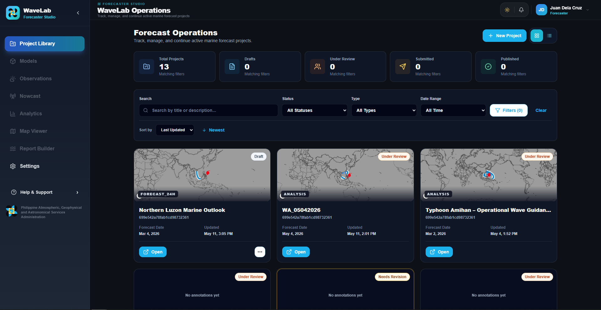

**Figure 1.** Forecaster Project Library in card view.

1. Log in with a Forecaster account.
2. Open the Forecaster dashboard.
3. Go to **Project Library**.
4. Review the project cards or switch to list view.

The Project Library shows projects that match the current search, filters, and sorting settings.

### Use list view

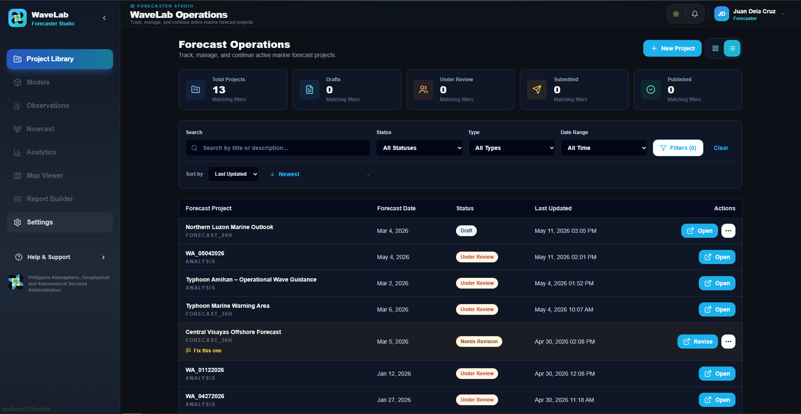

**Figure 2.** Forecaster Project Library in list view with compact row actions.

Use list view when you want to scan project names, statuses, dates, and action buttons in a table-style layout.

### Search, filter, and sort projects

1. Use the search field to find projects by name or related project details.
2. Use the status filter to narrow projects by workflow state.
3. Use the type filter to narrow by chart or forecast type.
4. Use date filters when needed.
5. Use the sort controls to change ordering.

The statistic cards show totals for the current search and filter state.

### Create a new project

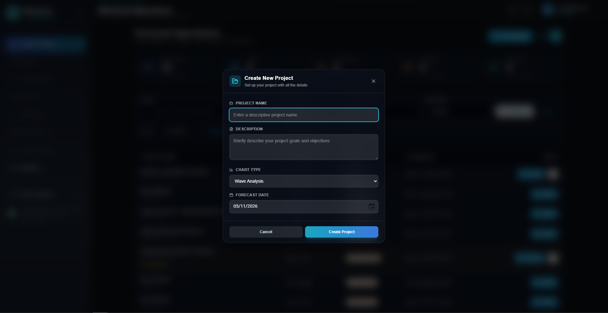

**Figure 3.** New project dialog or form.

1. Open **Project Library**.
2. Select the new project action.
3. Enter the required project details.
4. Confirm project creation.
5. After the project is created, open it in Studio.

A newly created project starts as **Draft**.

### Open a project in Studio

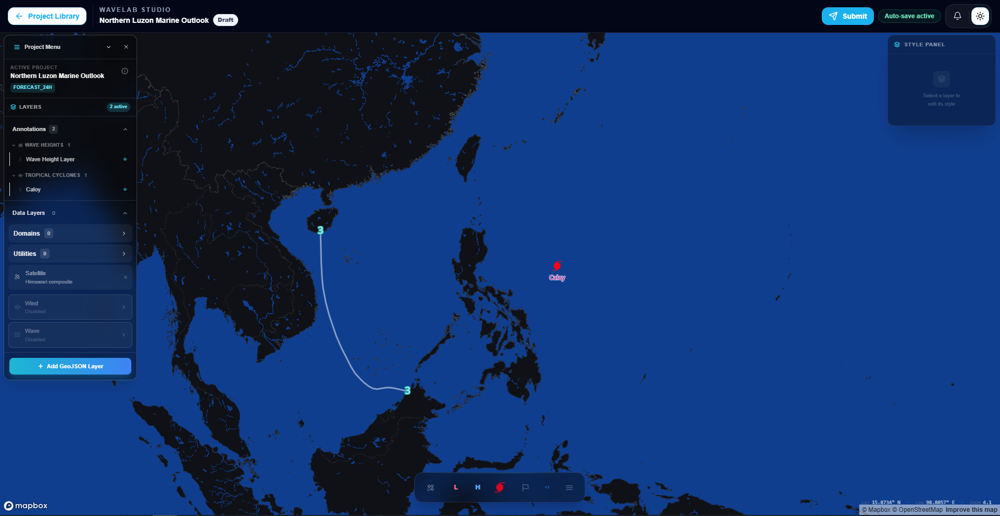

**Figure 4.** Studio with an editable project.

1. Open **Project Library**.
2. Find the project.
3. Select **Open**.
4. The project opens in Studio.

If the project is editable, Studio tools are available. If the project is locked, Studio opens in read-only mode.

### Add markers and symbols

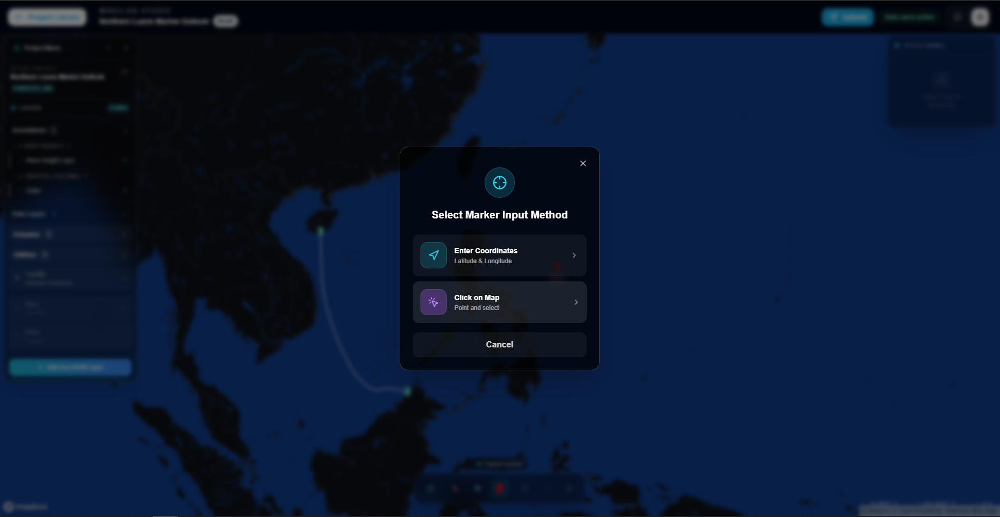

**Figure 5.** Marker input method options.

1. Open an editable project in Studio.
2. Select a marker or symbol tool.
3. Choose how to place the marker:
   1. Enter coordinates manually, or
   2. Click on the map.
4. Add the required label or details if prompted.
5. Save the marker.

Common marker types include:

- Tropical cyclone / typhoon
- Low pressure area
- High pressure area
- Less than 1 meter wave condition

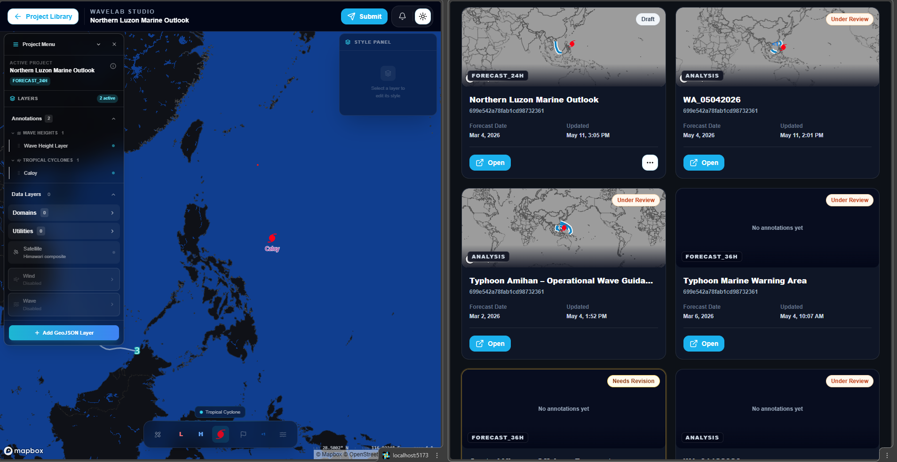

**Figure 6.** Project Library preview cards show marker icons without labels.

Project Library preview cards show marker icons without labels. Larger preview and review maps may show labels when needed.

### Add drawings and annotations

1. Open an editable project in Studio.
2. Select the drawing or annotation tool.
3. Draw the feature on the map.
4. Confirm or save the annotation.
5. Repeat as needed.

Annotations are saved to the current project.

### Save work

Most annotations are saved as part of the project editing flow. If a save action is shown, use it before leaving Studio.

Before submitting, check that all important markers, symbols, and annotations are visible.

### Submit a project for review

1. Open the project in Studio or Project Library.
2. Confirm the project is ready for review.
3. Select **Submit**.
4. Confirm submission if prompted.

After submission:

- The project status changes to **Submitted**.
- The project becomes read-only for the Forecaster.
- Admin users can review the project.

### Understand read-only mode

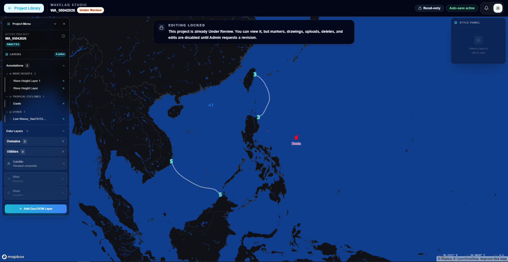

**Figure 7.** Studio read-only state after submission.

Studio becomes read-only when the project is not editable.

Read-only mode applies when a project is:

- Submitted
- Under Review
- Approved
- Published
- Archived

In read-only mode:

- Editing tools are hidden or disabled.
- New markers and annotations cannot be saved.
- Existing features cannot be changed.
- The project can still be viewed.

### Work with a revision-requested project

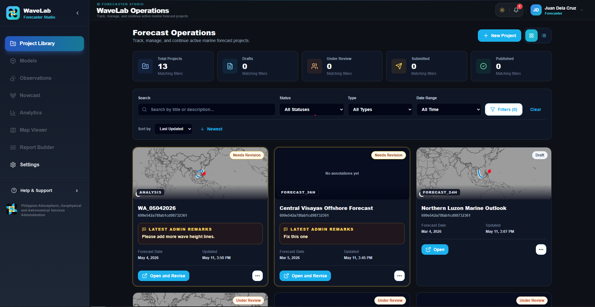

**Figure 8.** Needs Revision project with latest admin remarks.

When an admin requests changes, the project appears as **Needs Revision** or **Revision Requested**.

1. Open **Project Library**.
2. Find the project with the revision status.
3. Review the latest admin remarks.
4. Select **Open and Revise** or **Revise**.
5. Make the required changes in Studio.
6. Save the changes.
7. Resubmit the project.

After resubmission, the project returns to the review workflow and becomes read-only again.

## Admin review guide

### Open Review Charts

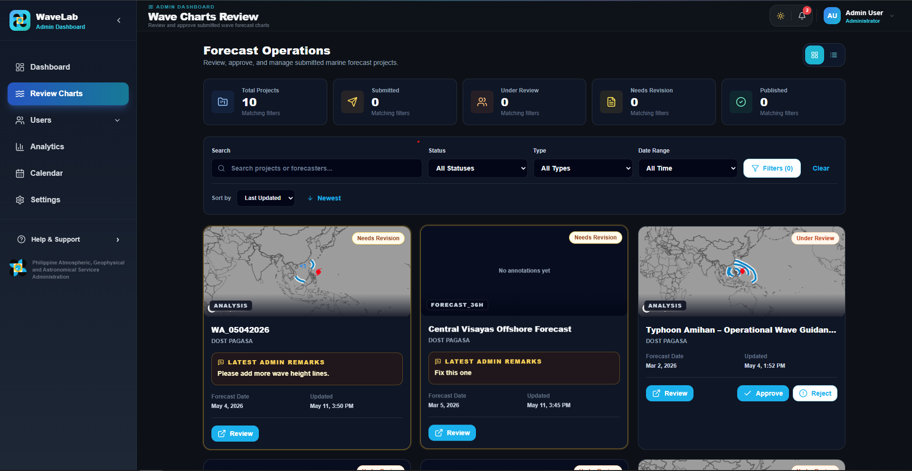

**Figure 9.** Admin Review Charts page.

1. Log in with an Admin account.
2. Open the admin dashboard.
3. Go to **Review Charts** or the project review area.
4. Review projects in card or list view.

Admin views do not show draft-only projects that are not ready for review.

### Search, filter, and sort review projects

1. Use search to find projects by name, owner, or related project details.
2. Use status filters to focus on submitted, under review, revision requested, approved, rejected, published, or archived projects.
3. Use type filters to narrow the chart or forecast type.
4. Use sorting to order by update date, creation date, name, or status.

The statistic cards show totals for the current search and filter state.

### Open the Project Review Modal

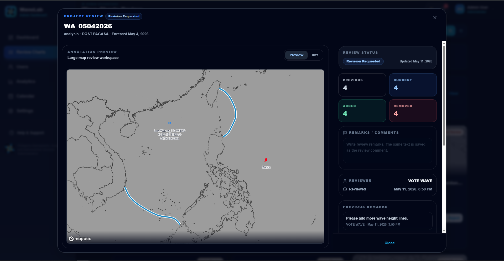

**Figure 10.** Project Review Modal in Preview mode.

1. Find a project in Review Charts.
2. Select **Review**.
3. The Project Review Modal opens.

The modal includes:

- Project summary
- Preview map
- Diff view
- Review status
- Annotation counters
- Remarks field
- Reviewer details
- Audit timeline
- Review action buttons

### Use Preview mode

Preview mode shows the current project annotations.

Use Preview mode to:

- Inspect the current submitted chart.
- Check markers and drawings.
- Verify that the visible annotations match the expected forecast output.

### Use Diff mode

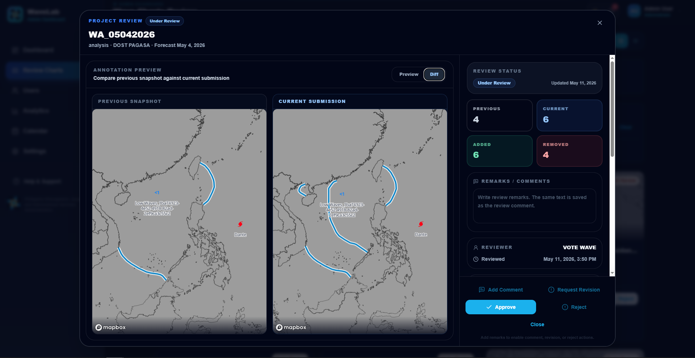

**Figure 11.** Diff mode showing previous and current project versions.

Diff mode compares a previous project snapshot with the current submission.

Use Diff mode to:

- Compare changes after a revision.
- See previous and current annotation counts.
- Review added or removed features.

The counters help summarize the comparison:

- **Previous**: number of annotations in the previous snapshot.
- **Current**: number of annotations in the current submission.
- **Added**: annotations that exist in the current submission but not in the previous snapshot.
- **Removed**: annotations that existed previously but are no longer in the current submission.

### Add a review comment

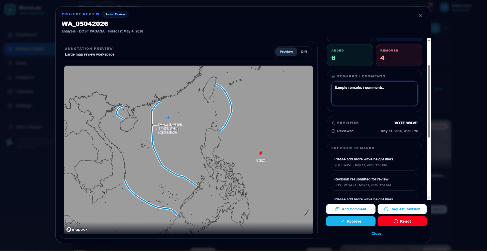

**Figure 12.** Remarks field and review action buttons.

1. Open the Project Review Modal.
2. Type a comment in **Remarks / Comments**.
3. Select **Add Comment**.

The comment is saved to the project review history.

The Add Comment button is disabled until remarks are entered.

### Request revision

Use **Request Revision** when the project needs changes before approval.

1. Open the Project Review Modal.
2. Review the project in Preview or Diff mode.
3. Enter clear remarks explaining what must be changed.
4. Select **Request Revision**.
5. Confirm the project status changes to **Revision Requested** or **Needs Revision**.

The Forecaster can edit the project again after revision is requested.

The Request Revision button is disabled until remarks are entered.

### Approve a project

Use **Approve** when the project is correct and ready for publishing.

1. Open the Project Review Modal.
2. Review the chart and annotations.
3. Confirm no revision is needed.
4. Select **Approve**.

After approval:

- The project status changes to **Approved**.
- The project remains locked for Forecaster editing.
- The project can be published by an Admin.

### Reject a project

Use **Reject** when the project should not continue in the current workflow.

1. Open the Project Review Modal.
2. Enter remarks explaining why the project is rejected.
3. Select **Reject**.

The Reject button is disabled until remarks are entered.

### Publish an approved project

Use **Publish** after a project has been approved.

1. Open the approved project.
2. Review the final chart if needed.
3. Select **Publish**.
4. Confirm the project status changes to **Published**.

Published projects are final and read-only.

## Notifications

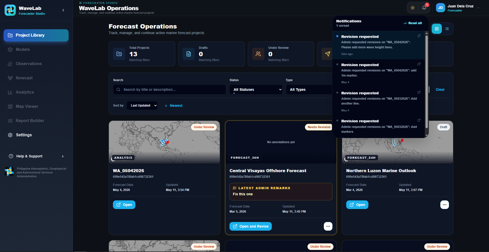

**Figure 13.** Notification bell with recent project activity.

WaveLab uses notifications to keep users informed about review activity.

Notifications may appear when:

- A project is submitted.
- A review comment is added.
- A revision is requested.
- A project is approved.
- A project is rejected.
- A project is published.

To check notifications:

1. Select the notification bell.
2. Review unread and recent notifications.
3. Open the related project when needed.

## Theme support

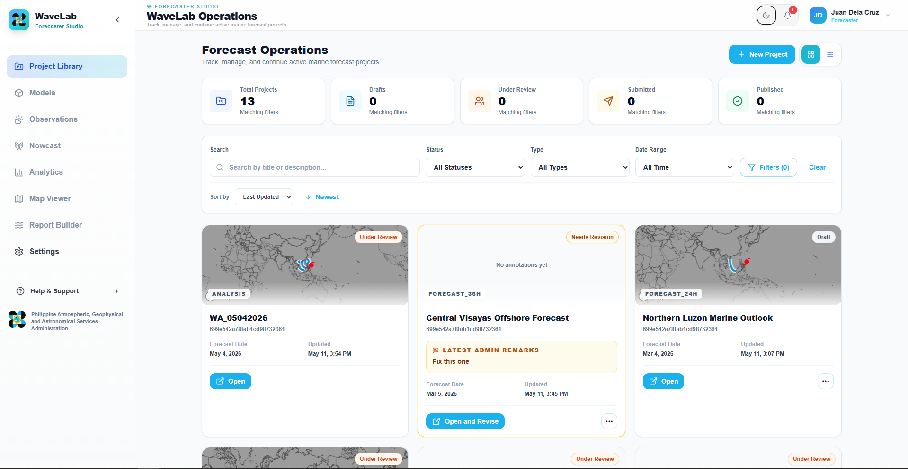

**Figure 14.** Light mode view.

WaveLab supports light and dark themes.

Theme-aware areas include:

- Project Library
- Review Charts
- Project cards and tables
- Review modal
- Studio header and controls
- Sidebar and dashboard layout

If a page does not match the selected theme after an update, refresh the browser.

## Troubleshooting

### Project does not open in Studio

Try these checks:

1. Confirm the project still exists in Project Library.
2. Open the project again from the card or list row.
3. Refresh the page.
4. If the project URL contains an invalid project ID, return to Project Library and reopen it.

### Marker or symbol does not save

Possible causes:

- The project is locked.
- The project is submitted, under review, approved, published, or archived.
- The project was opened without a valid project ID.
- The session expired.

Try these steps:

1. Confirm the project status is editable.
2. Refresh Studio.
3. Reopen the project from Project Library.
4. Log in again if the session expired.

### Project is read-only

A project is read-only when it is no longer editable by the Forecaster.

Read-only statuses include:

- Submitted
- Under Review
- Approved
- Published
- Archived

If changes are needed, an Admin must request a revision.

### Review action is disabled

Some review actions require remarks.

Disabled actions usually mean:

- Remarks are required but empty.
- The project is not in the correct status.
- The action is not available for the current role.
- The Admin is trying to review their own project.

### Preview map does not show annotations

Try these checks:

1. Confirm the project has saved annotations.
2. Refresh the page.
3. Reopen the project or review modal.
4. Check whether the map is still loading.

### Project Library statistics look different after filtering

Project Library statistics are based on the current search and filters.

Clear filters if you want to see broader project totals.

## FAQ

### Can a Forecaster edit a submitted project?

No. Submitted projects are locked until an Admin requests a revision or the workflow returns the project to an editable state.

### Can a Forecaster edit a revision-requested project?

Yes. Revision Requested or Needs Revision projects are editable so the Forecaster can make the requested changes.

### Why is the Submit button not visible?

The project may not be in an editable or submittable status. Only allowed workflow states can be submitted or resubmitted.

### Why do review buttons require remarks?

Remarks help explain review decisions and give Forecasters clear instructions. Comments, revision requests, and rejection actions require remarks.

### Why are labels hidden in Project Library preview cards?

Preview cards are small. Labels are hidden to keep the card readable. Larger preview and review maps can show labels.

### Why do marker icons look different in preview cards?

Preview cards use the saved marker type to show the matching hazard icon, such as typhoon, low pressure, high pressure, or less-than-1-meter wave condition.

### Can an Admin review their own project?

No. Admin self-review is blocked to protect review integrity.

### What should I do before publishing?

Review the final project in Preview mode, confirm the annotations are correct, and make sure the project has been approved.
